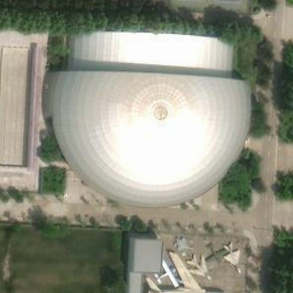
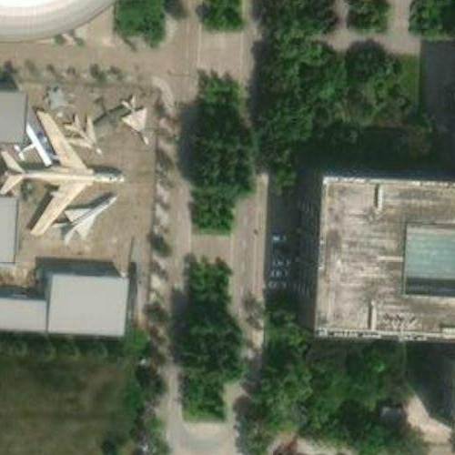
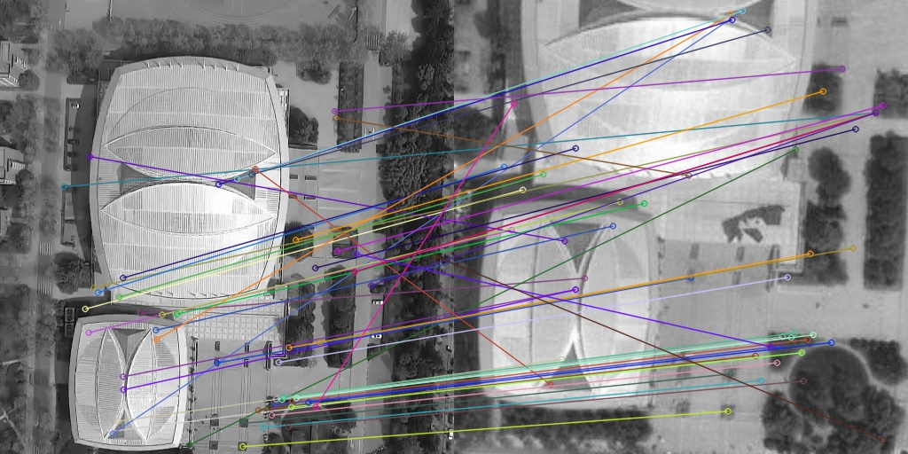

# :rocket: Visual Locator :rocket:

his project designs an absolute visual positioning software for drones based on deep learning. The design process of the software is to train on the server using eight RTX3090 graphics cards with a video memory of 24G to obtain an image retrieval model. Then, when the recall rates of the top 1, 5, 10, and 20 of the model on the test set meet certain requirements, save the model weights for subsequent calls. Then, it is necessary to perform image registration tests on the top K images retrieved. We provide SIFT, SuperPoint, and LoFTR training and test model weights for testing and registration, and provide different registration model algorithms for different scenarios such as seasonal changes and lighting changes.  

## 1.Project Structure :fire:

The main design idea of the software is through a two-stage method of image retrieval and image registration: Image retrieval queries the top K (1, 5, 10, 20) cropped similar satellite maps according to the current frame of drone images. Image registration obtains the similarity between the current frame image and K images through the registration algorithm and votes to select the best satellite image to realize the mapping of the corresponding positions of drone images and satellite maps. Then, the latitude and longitude coordinates of the current position of the drone are obtained through the preloaded GeoTIFF format map.  Just like the following figure shows:

| Query Image | Reference Image | Retrieved Image |
| :---: | :---: | :---: |
|  |  |  |

## Continuously Updating