# :rocket: Visual Locator :rocket:

This project designs an absolute visual positioning software for drones based on deep learning. The design process of the software is to train on the server using eight RTX3090 graphics cards with a video memory of 24G to obtain an image retrieval model. Then, when the recall rates of the top 1, 5, 10, and 20 of the model on the test set meet certain requirements, save the model weights for subsequent calls. Then, it is necessary to perform image registration tests on the top K images retrieved. We provide SIFT, SuperPoint, and LoFTR training and test model weights for testing and registration, and provide different registration model algorithms for different scenarios such as seasonal changes and lighting changes.

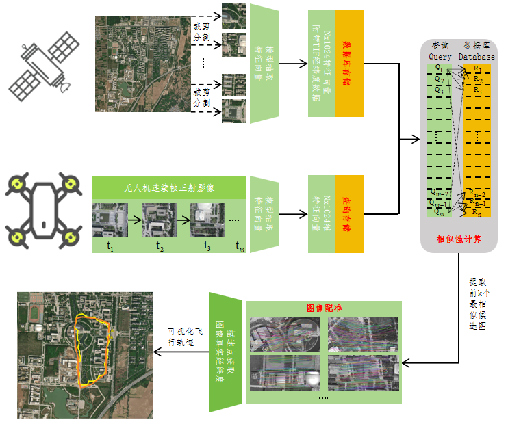

## :fire:1.Project Structure :fire:

The main task of this project is to construct an absolute visual positioning system for unmanned aerial vehicles (UAVs). By designing an appropriate network model, the mapping relationship between the orthophoto image of the UAV and the satellite image data is completed, thereby determining the position information of the UAV and achieving absolute visual positioning of the UAV. Specifically, the research process mainly includes four parts: the design of deep learning model algorithms, training and inference on public datasets, the collection and verification of self-built datasets, and the encapsulation of the overall visual positioning system. Through the above four parts, the visual positioning system as shown in Figure 2 was successfully constructed. The system structure specifically includes two major parts: image retrieval and image registration, and multiple techniques such as model fine-tuning based on pre-training, extraction of outdoor scene feature points, and external point denoising optimization were used.

The main design idea of the software is through a two-stage method of image retrieval and image registration: Image retrieval queries the top K (1, 5, 10, 20) cropped similar satellite maps according to the current frame of drone images. Image registration obtains the similarity between the current frame image and K images through the registration algorithm and votes to select the best satellite image to realize the mapping of the corresponding positions of drone images and satellite maps. Then, the latitude and longitude coordinates of the current position of the drone are obtained through the preloaded GeoTIFF format map.  Just like the following figure shows:

| Query Image | Reference Image | SiFT+RANSIC|  SuperPoint+SuperGlue|
| :---: | :---: | :---: | :---:|
| 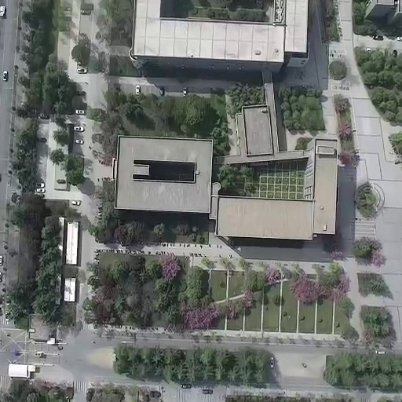 | 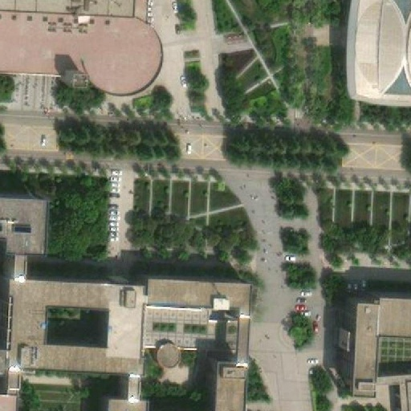 | 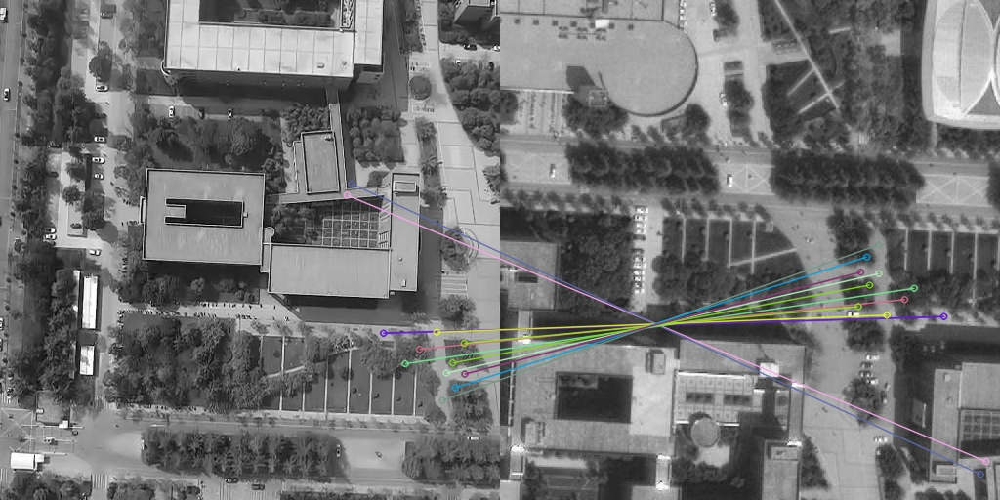 | 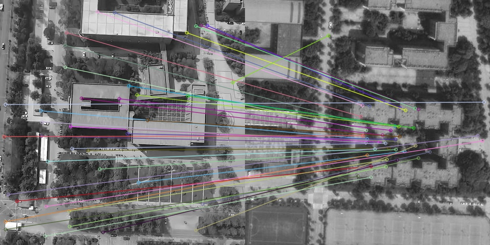 |
| 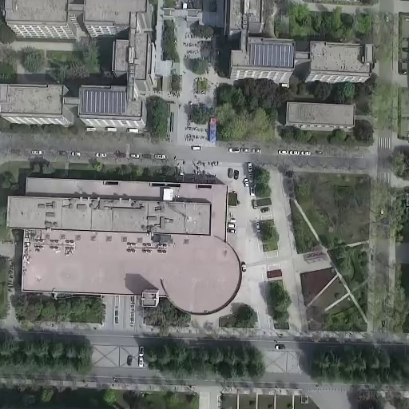 | 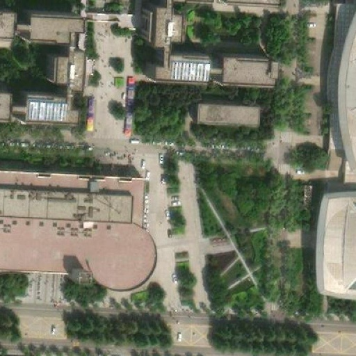 | 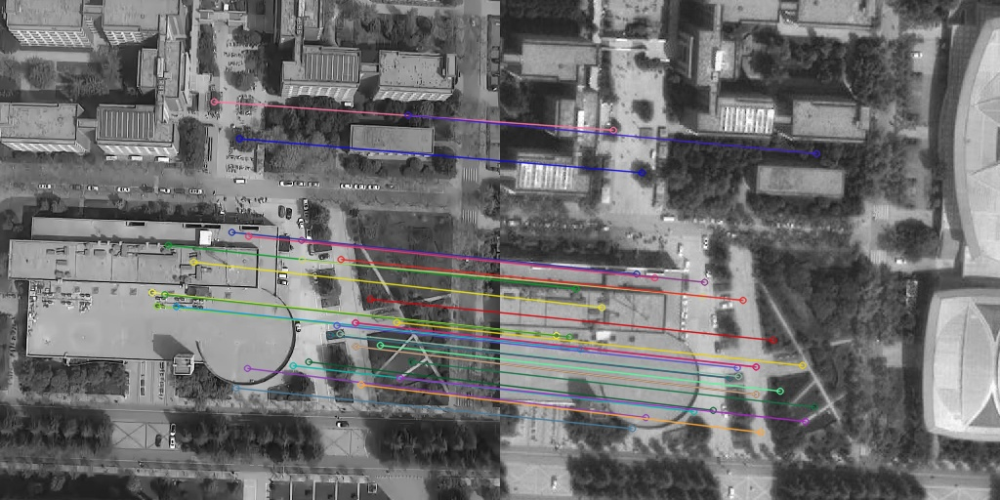 | 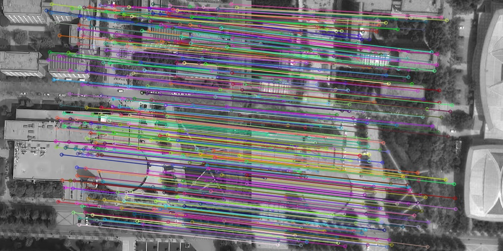 |
| 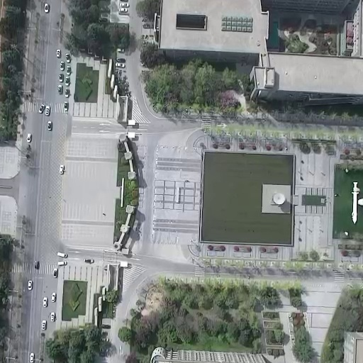 | 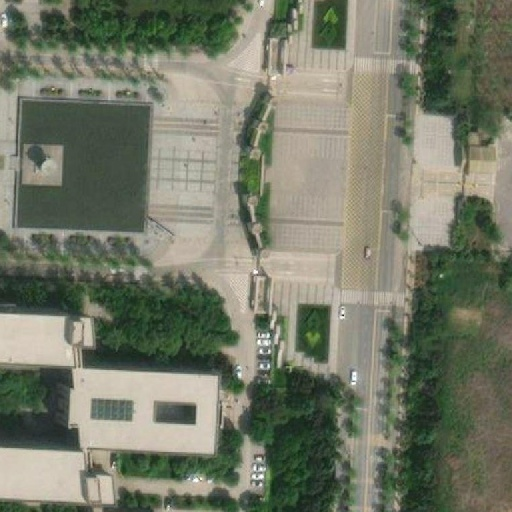 | 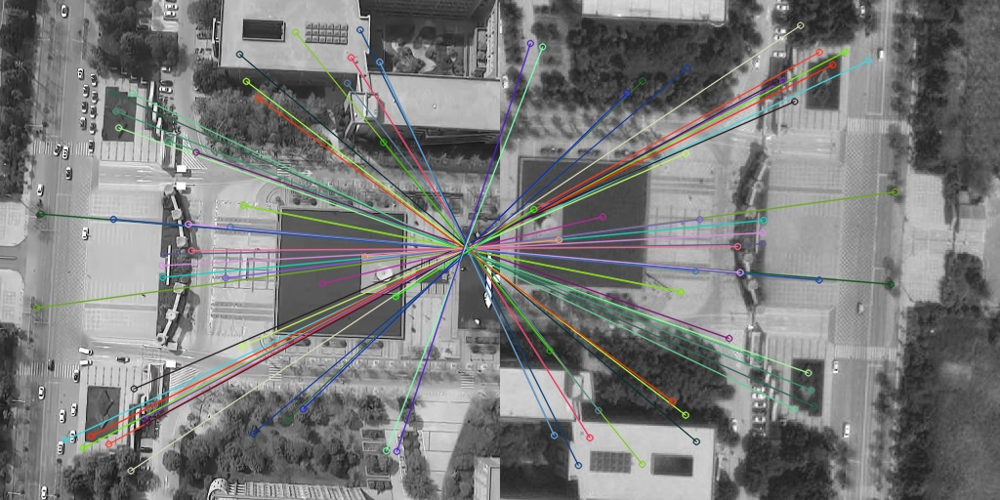 | 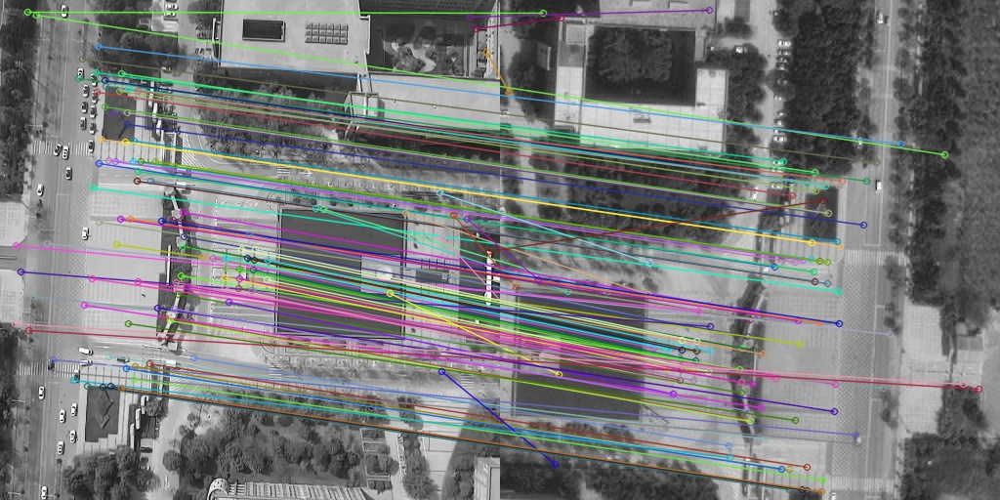 |
| 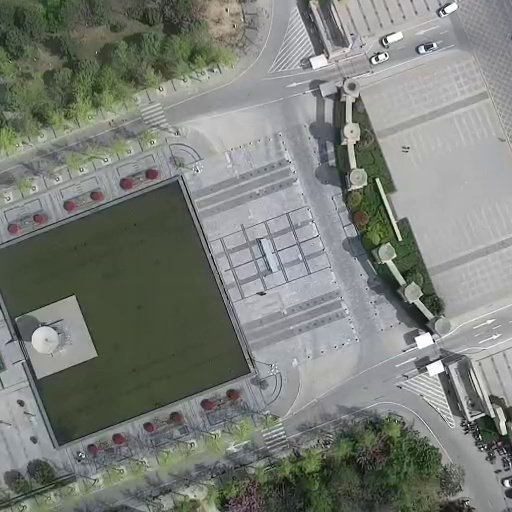 | 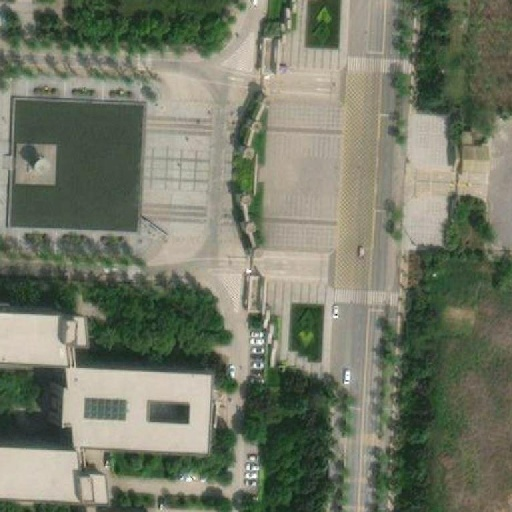 | 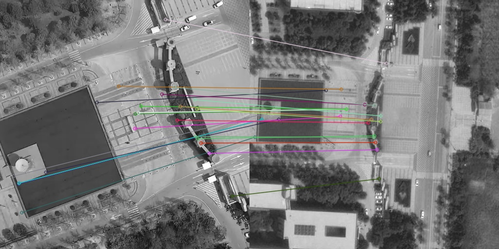 | 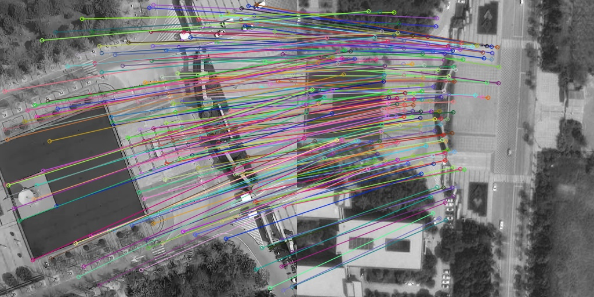 |
| 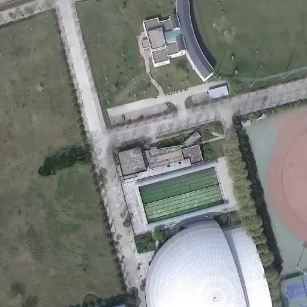 | 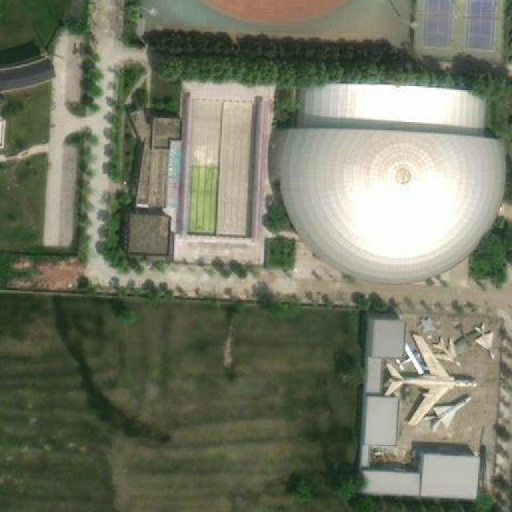 | 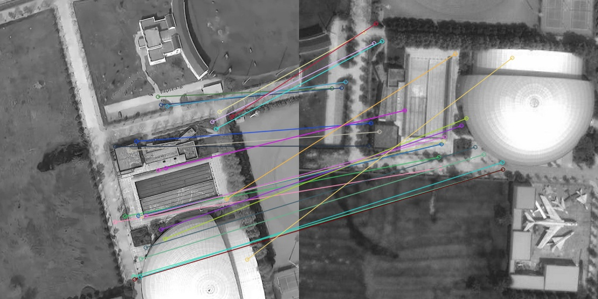 | 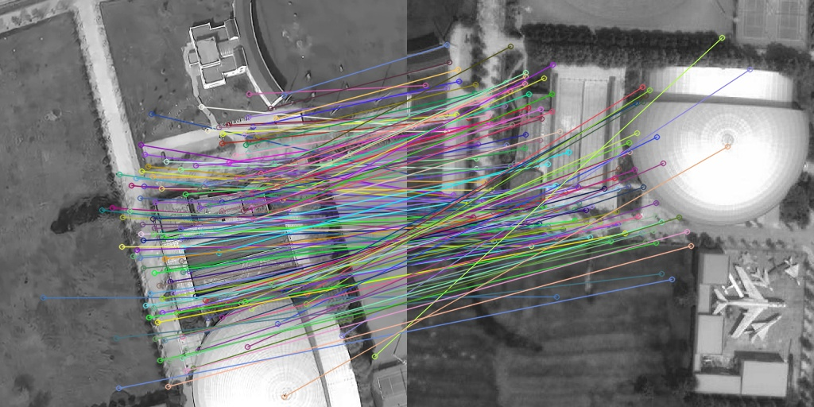 |
| 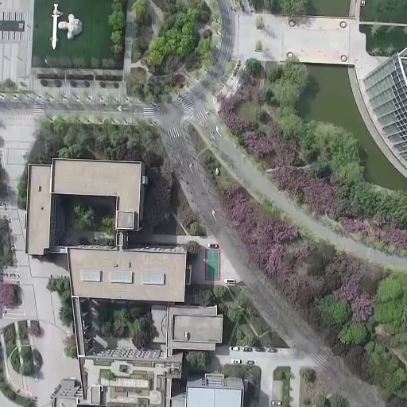 | 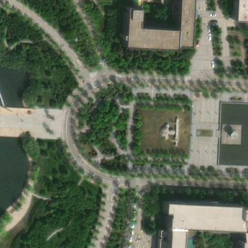 | 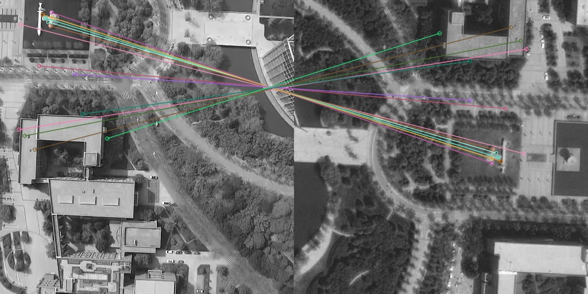 | 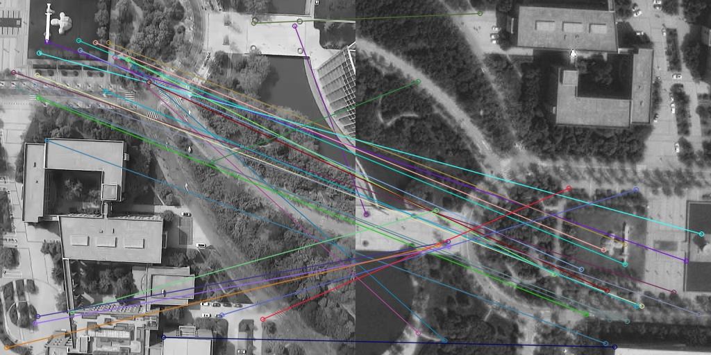 |

## :mag: 2.Retrieval Algorithm :mag:

As the most crucial part of the implementation of this project, the better the performance of retrieval recall (retrieval recall is the ratio of the number of relevant items that are retrieved correctly to the actual total number of relevant items, denoted as Recall@K), the better the software 's subsequent localization performance. Because the retrieval process must require the Query of database images to be completed quickly, efficiently and accurately, if the satellite area map of the location of the query image can be included in the top K images with the highest similarity returned, the subsequent image registration requirements can be well carried out.
To ensure that Recall@1~10 can reach above 90%, for Prithvi_The 100M and SelaVPR methods were compared and tested. It was found that the local-global feature retrieval method based on ViTs was superior. Therefore, the pre-trained model of SelaVPR was chosen for fine-tuning training. In the Adapter Fine-Tuning technique is selected to be used for the ViTs model by freezing the parameters of the backbone network. An additional layer of Adapter is added to the multi-head attention output of the encoder layer of the Vision of Transformer encoder and the bypass of Feed-Forward for fine-tuning training for the retrieval task of perspective changes in remote sensing images and unmanned aerial vehicle perspective images. So as to improve the model's ability to cope with the changes of many factors such as illumination, scale and season brought about by absolute visual positioning. First, let's explain the principle of the Adapter fine-tuning technique: It refers to a method of fine-tuning models in deep learning. An Adapter is a small module that is input into a pre-trained model. By adjusting these Adapters, the pre-trained model for specific tasks can be fine-tuned with relatively small computing resources and data volume to better adapt to specific task requirements, without the need for large-scale adjustments to all parameters of the entire pre-trained model. For example, in natural language processing, Adapter fine-tuning can be used to enable a pre-trained language model to adapt to different text classification tasks, named entity recognition tasks, etc.

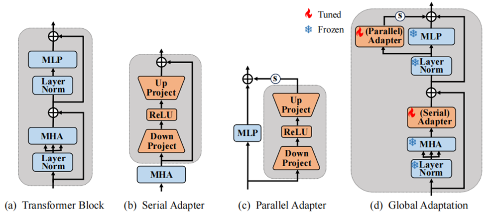

The fine-tuning using Adapter mainly makes changes to the model in two places: A serial Adapter is added at the output position of the multi-head attention layer. The purpose of doing this is to hope that through the multi-head attention mechanism, the model will pay more attention to the extraction of local features between remote sensing images and images captured by unmanned aerial vehicles; Adding the residual connection parallel Adapter after the Layer Norm to the MLP of the forward propagation layer aims to handle the global features of the image data through cross-layer parallel connection. Therefore, in this encoder, through fine-tuning technology training, the model pays more attention to grasping local features and the global scale, thereby improving the effective mapping from the image to the feature vector. Sure, this time Vision of Transformer selects vit_The model with large parameters outputs a feature dimension of [1, 1024]. Also, if you want to see the selavpr code, you can click [here](models/selavpr).

The SelaVPR method uses the Vision Transformer (ViT) network to efficiently extract local and global features of images. The input image is processed into blocks by using ViT, and the relationships between different image blocks are captured through the self-attention mechanism to extract the global context information. Meanwhile, this method innovatively introduces the fine-tuning technology of the pre-trained model of Dinov2. By training and reasoning on large-scale satellite image images to obtain the basic model, and then conducting Adapter fine-tuning training based on the existing dataset, the feature extraction performance of the model is improved to ensure sufficient retrieval accuracy for subsequent image detection. The original Author is [here](https://github.com/Lu-Feng/SelaVPR).

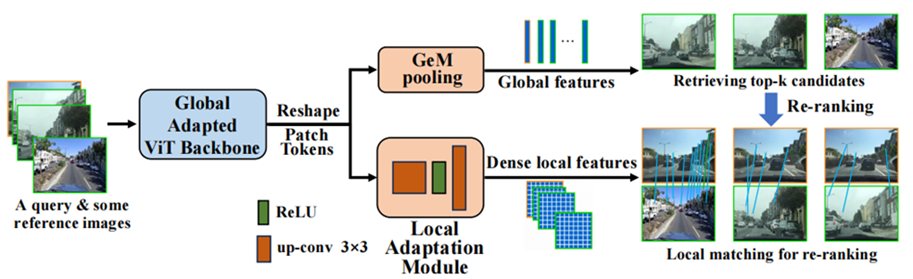

## :heart:Thanks :heart:

If you are interested in this project design, please give a star. And it is also recommended to refer to the original open-source authors. Many thanks to the contributions of the original open-source authors!

